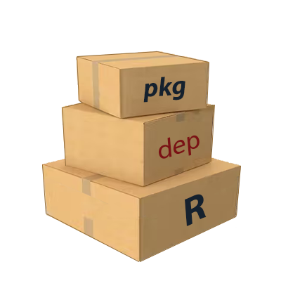

<!-- README.md is generated from README.Rmd. Please edit that file -->

```{r, include = FALSE}
knitr::opts_chunk$set(
  collapse = TRUE,
  comment = "#>",
  fig.path = "man/figures/",
  out.width = "100%"
)
```
# pkgdepR 

[](https://cran.r-project.org/package=pkgdepR)
[](https://cran.r-project.org/package=pkgdepR)
[](https://github.com/edpeyton/pkgdepR/actions/)
[](https://CRAN.R-project.org/package=pkgdepR)
[](https://lifecycle.r-lib.org/articles/stages.html)

# Introduction 

Have you ever wanted to visualize dependencies between functions for a group of R packages you have developed?

`pkgdepR` takes any number of (correctly compiled) R packages and finds the links between all of the function in those namespaces.

## About

### Motivation

`pkgdepR` was created to solve a particular problem when developing interrelated R packages and wanting to see how all the functions in each package interacted.

This was particularly useful in managing the function dependencies across a large code base of R packages.

### How does it work?

`pkgdepR` simply takes as an argument a vector of package names (that should already be on the search path) and explores how each of the functions in each of the namespaces interact. It does this in two stages:  

* Getting all intra-package function dependencies for each package; *and*  
* Getting all inter-package function dependencies for each combination of packages.

Each defined name in a particular package's namespace that is also a function is then decomposed. From this decomposition, if any function is found to be called within its contents, then a link is created. To properly identify distinct name calls, a search is done for a package tag preceding the name (i.e. `::`). If no tag exists, then a search for an imported function is conducted. On the other hand, if the function name is already declared in the primary namespace, then it is obviously that function being called.

If a function is ambiguously called (without a package tag or not being explicitly imported from another namespace) then it is deliberately ignored in the linkage. This is because the linkage would be environment-dependent and would change depending on the contents of the search path in that particular session.

### S3 methods

The main wrapper function for `pkgdepR` is `pkgdepR::deps(...)` which returns an object of class `pkgdepR`. An S3 method has been created for objects of class `pkgdepR` so they can be easily plotted. See `?pkgdepR::plot.pkgdepR` for further details.

`pkgdepR` makes use of the fantastic [visNetwork](https://github.com/datastorm-open/visNetwork) package for creating an interactive network visualization of the functions present in R packages.

```{r loadpkg, include=FALSE}
library(magrittr)
library(pkgdepR)

```

All implemented methods for this class are:
```{r, eval = T}
methods(class = "pkgdepR")
```

## Caveats
The links between functions are determined **statically**, meaning the dependencies are identified without executing any code. As such, any functions that are defined dynamically at run-time will not be picked up. In the example below, `foo()` will be picked up as it is declared in the package's namespace. However, `bar()` will not be picked up as it is only defined at run-time when `foo()` is called.
```r
# @title foo function
# @export
foo = function() { # - this will be picked up!

  bar = function() { # - this won't be picked up!
  
  }
  
  bar()

}

```

Similarly, there can be cases where linkages are created that may not occur at run-time. Let's add to the previous example, by adding a function `bar()` declared in the package namespace we are interested in. 

```r
# @title bar function
# @export
bar = function() { # - this will be picked up!

}

```

Then, statically, it appears that `foo()` is calling the `bar()` from the namespace we are interested in. However, at run-time, we know this is **not** the case, as `bar()` is clearly defined locally and it is the local function that is called. In this instance, `pkgdepR` will show a link between `package::foo()` and `package::bar()` when no real run-time dependency exists.

These cases will rarely arise in normal package development, but it is important to be aware of the behaviour nonetheless.

## Installation

You can install the released version of `pkgdepR` from [CRAN](https://CRAN.R-project.org) with:

```r
install.packages("pkgdepR")
```

And the development version from [GitHub](https://github.com/edpeyton/pkgdepR) with:

```r
devtools::install_github("edpeyton/pkgdepR")
```


# How to use
Here we'll show an example of how to use `pkgdepR`.

First, let's load the required packages.

```r
library(magrittr)
library(pkgdepR)

```


The required packages have now been added to the search path.

## Single package
Create a `pkgdepR` object as follows:
```{r single, eval = T}
v = pkgdepR::deps(pkg = "pkgdepR")
```

We can see a summary of the object
```{r single2, eval = T}
v
```

To see the network visualization, simply call plot.
```r
plot(v)

```

## Multiple packages
Visualizing multiple packages works in a similar way.
```{r multiple, eval = T}
v = pkgdepR::deps(pkg = c("pkgdepR", "magrittr"))
```

```{r multiple2, eval = T}
v
```

```{r multiple1, eval = F}
plot(v)
``` 


## Contributors
[Ed Peyton](https://github.com/edpeyton)


*****

<a href="#top">Back to top</a>
  
  