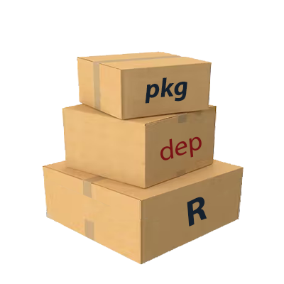

```{r, include = FALSE}
knitr::opts_chunk$set(
  collapse = TRUE,
  comment = "#>",
  fig.path = "",
  out.width = "100%"
)
```

<style>
    img {
        border: 0;
    }
</style>

## About  

### Why create `{pkgdepR}`?

`{pkgdepR}` was created to solve a particular problem I had faced when developing interrelated R packages within organizations. Oftentimes, I would want to see (visually) how all the functions in one package interacted with all the functions in another package.

This was particularly useful in managing the function dependencies across a large code base of R packages.

### How does `{pkgdepR}` work?

`{pkgdepR}` simply takes as an argument a vector of package names (that should already be on the search path) and explores how each of the functions in each of the namespaces interact. It does this in two stages:  

* Getting all intra-package function dependencies for each package; *and*  
* Getting all inter-package function dependencies for each combination of packages.

Each defined name in a particular package's namespace that is also a function is then decomposed. From this decomposition, if any function is found to be called within its contents, then a link is created. To properly identify distinct name calls, a search is done for a package tag preceding the name (i.e. `::`). If no tag exists, then a search for an imported function is conducted. On the other hand, if the function name is already declared in the primary namespace, then it is obviously that function being called.

If a function is ambiguously called (without a package tag or not being explicitly imported from another namespace) then it is deliberately ignored in the linkage. This is because the linkage would be environment-dependent and would change depending on the contents of the search path in that particular session.

### S3 methods for `{pkgdepR}` objects

The main wrapper function for `{pkgdepR}` is `pkgdepR::deps(...)` which returns an object of class `pkgdepR`. An S3 method has been created for objects of class `pkgdepR` so they can be easily plotted. See `?pkgdepR::plot.pkgdepR` for further details.

```{r loadpkg, include=FALSE, eval = T}

library(pkgdepR)
library(magrittr)

```

All implemented methods for this class are:
```r
methods(class = "pkgdepR")
#> [1] plot    print   summary
#> see '?methods' for accessing help and source code
```

#### Plotting `{pkgdepR}` objects
Objects of class \code{pkgdepR} can be plot using `plot(...)`. In this visualization, functions that are exported from their namespace are shown as circles, whilst non-exported functions are shown as squares. No arrow should go from a square node to another node of a different colour.

## Installation

You can install the released version of `{pkgdepR}` from [CRAN](https://CRAN.R-project.org) with:

```r
install.packages("pkgdepR")
```

And the development version from [GitHub](https://github.com/edpeyton/pkgdepR) with:

```r
devtools::install_github("edpeyton/pkgdepR")
```


# How to use
Here we'll show an example of how to use `{pkgdepR}` using some test packages that are hosted on GitHub.

First, let's load the required example packages.

```r

library(pkgdepR)
library(magrittr)

```

The required packages have now been added to the search path.

## Single package
Create a `pkgdepR` object as follows:
```{r single, eval = T}
v = pkgdepR::deps(pkg = "pkgdepR")
```

We can see a summary of the object
```{r single2, eval = T}
v # alternatively, summary(v) or print(v)
```

To see the network visualization, simply call plot.
```{r single1, eval = T}
plot(v, height = "500px", main = list(text = NULL))
```
  
<br>\
<br>\
<br>\
    
## Multiple packages
Visualizing multiple packages works in a similar way.
```{r multiple, eval = T}
v = pkgdepR::deps(pkg = c("pkgdepR", "magrittr"))
```

```{r multiple2, eval = T}
v # alternatively, summary(v) or print(v)
```

```{r multiple1, eval = T}
plot(v, height = "700px", main = list(text = NULL), option = "E")
``` 

  
<br>\
<br>\
<br>\
<strong>It's as simple as that! </strong>

******


<a href = "#top">Back to top</a>